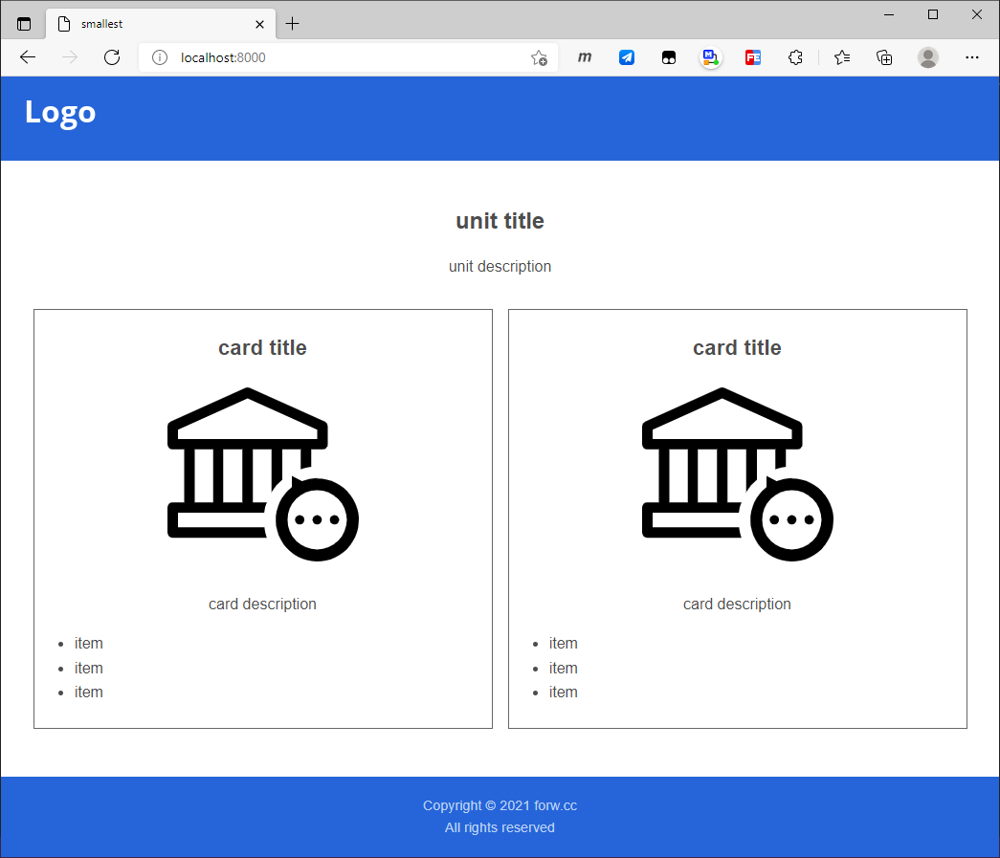

# Markdown Single Page Web

Build a single page web by markdown.

## 1. Usage

Web like this:



Build by this:

```markdown
# smallest

## unit title

unit description

### card title


card description

- item
- item
- item

### card title


card description

- item
- item
- item

## CONFIG

### header

#### logo


### footer

#### ending

Copyright © 2021 forw.cc  
All rights reserved
```

That is means:

| Markdown   | Web              | Other |
| ---------- | ---------------- | ----- |
| h1         | html head title  |       |
| h1 content | page description |       |
| h2         | unit             |       |
| h2 content | unit description |       |
| h3         | card             |       |
| h3 content | card description |       |
| h4         | pop              |       |
| h4 content | pop description  |       |

## 3. Config

Use `## CONFIG` in the markdown file to add elements for the page:

| Markdown         | Web                | Other            |
| ---------------- | ------------------ | ---------------- |
| `### title`      | html head title    | will overwrite # |
| `### icon`       | html head icon     |                  |
| `### keywords`   | html head keywords |                  |
| `### logo`       | header logo        |                  |
| `### header-nav` | header nav         |                  |
| `### footer-nav` | footer nav         |                  |
| `### ending`     | footer ending      |                  |

Example:

```markdown
## CONFIG

### title

demo

### icon

image/logo.ico

### keywords

single page web one 

### header

#### logo


#### nav

- [About](#about)
- [Product](#product)
- [Support](#support)
- [Connect](#connect)

### footer

#### nav

[Declare](#) - [Email](#) - [Office](#) - [Thanks](#)

#### ending

Copyright © 2021 forw.cc  
All rights reserved  

```

